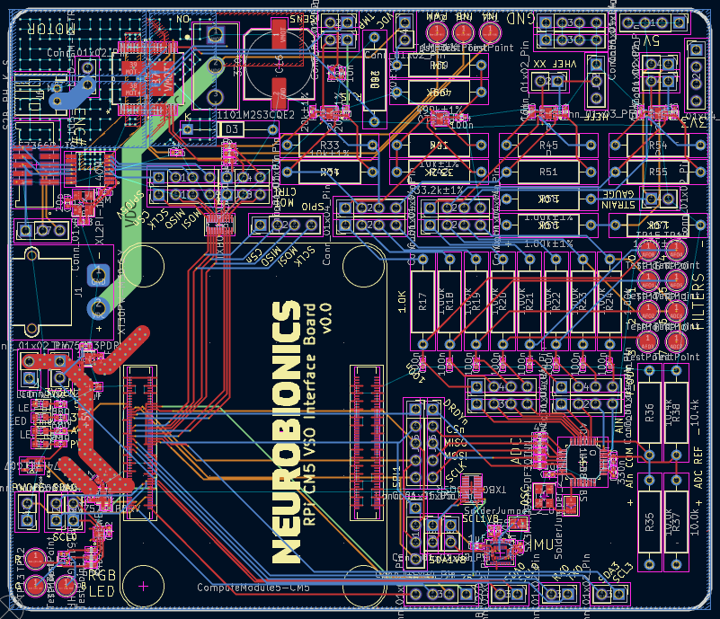
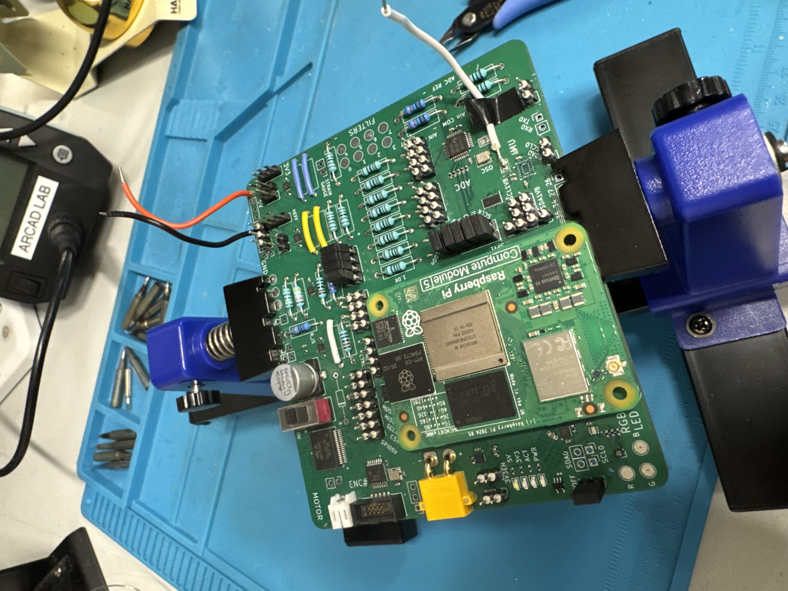

# WindBorne Embedded Electrical Engineer — Submission

## PCB Example
**Elegant feature:** I intentionally partitioned the design into modular blocks (power, DIO/level shifting, motor/encoder, and analog acquisition) with clear connectors and bring-up hooks (test points + jumpers). That made it easy to populate only what was needed for a given build and iterate quickly without changing the core PCB.

### Schematic
- [schematic.pdf](pcb/schematic/root.png)

### Layout

### Board Photos

## Resume
- [Isaac_Tourner_WindBorne_Resume.pdf](resume/Isaac_Tourner_WindBorne_Resume.pdf)
