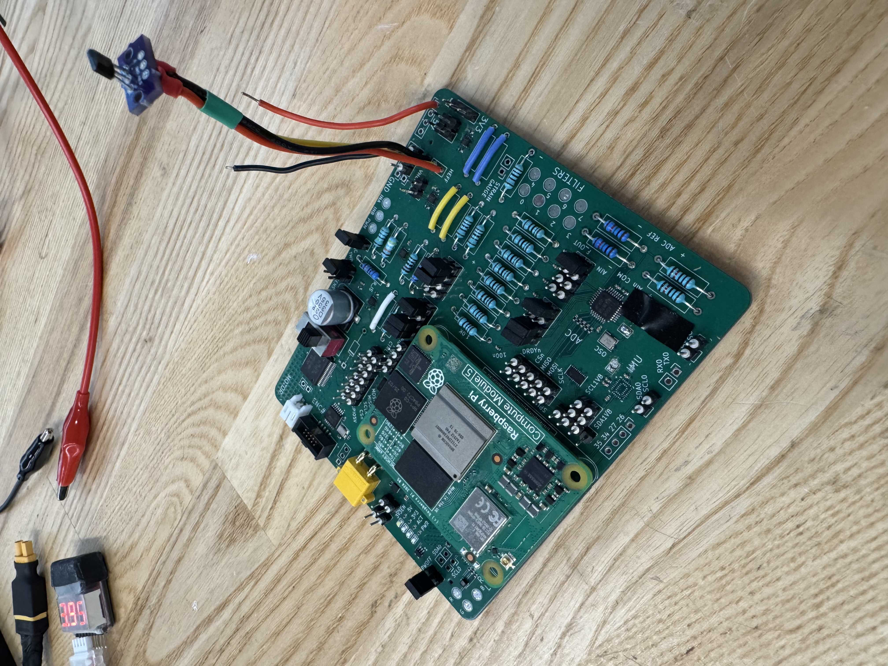

# WindBorne Embedded Electrical Engineer — Submission

## Resume
[Isaac_Tourner_WindBorne_Resume.pdf](resume/Isaac_Tourner_WindBorne_Resume.pdf)

## PCB Example
**Elegant feature:** I intentionally partitioned the design into modular blocks (power, DIO/level shifting, motor/encoder, and analog acquisition) with clear connectors and bring-up hooks (test points + jumpers). That made it easy to populate only what was needed for a given build and iterate quickly without changing the core PCB.

### Schematic
[schematic hierarchy](pcb/schematic/)
- [Root](pcb/schematic/Root.png)
  - [RPi](pcb/schematic/RPi.png)
  - [Power](pcb/schematic/Power.png)
  - [DIO](pcb/schematic/DIO.png)
  - [Motor](pcb/schematic/Motor.png)
  - [Analog](pcb/schematic/Analog.png)
  - [Connectors](pcb/schematic/Connectors.png)

### Layout

### Board Photos

  
  

